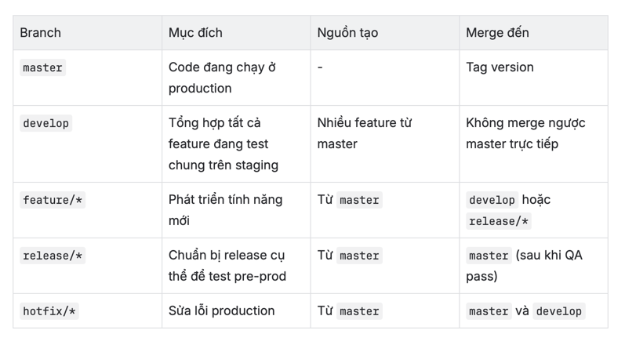

# This is codebase for all golang service

- Áp dụng nguyên tắc độc lập các tầng và "hướng vào trong" của Clean Architecture nhưng với sự đơn giản tối thiểu:


Ba tầng đơn giản: Transport, Business và Storage
- Transport: nơi tiếp nhận các HTTP Request từ Client, parse data nếu có, trả về đúng format JSON cho client. Ngoài nhiệm vụ này ra, những cái còn lại nó sẽ "uỷ thác" (delegate) cho tầng Business.
- Business: nơi thực hiện các logic chính của nghiệp vụ như cái tên của nó. Các thuật toán, logic sẽ cần dữ liệu. Tầng Business sẽ không trực tiếp đi lấy dữ liệu mà tiếp tục "uỷ thác" cho tầng Repository hoặc Storage.
- Storage: là tầng chịu trách nhiệm lưu trữ và truy xuất dữ liệu. Dù các bạn đang dùng hệ thống Database, File System hay Remote API thì cũng là ở tầng này. Đây là nơi cần viết code chi tiết cách thức giao tiếp với các đầu cung cấp dữ liệu.

- Dựa vào nguyên tắc thiết kế này, cấu trúc thư mục của 1 project golang sẽ gồm các thư mục sau:
  - cmd
    - Chứa các file có hàm main chạy 
  - pkg
    - Chứa các package thư viện dùng chung, ví dụ postgres, kafka...
  - constant
    - Chứa các hằng số dùng chung 
  - config
    - Chứa các biến môi trường dùng chung cho toàn bộ project 
  - middleware
    - Chứa các function cần xử lý như phần authenticate...
  - module
    - Chứa nhiều module khác nhau, mỗi module sẽ có cấu trúc thư mục như sau:
      - business:
        - Nơi implement logic
      - model:
        - define cấu trúc dữ liệu, như định nghĩa các table trong postgres
      - storage:
        - Nơi implement phần lưu trữ database hoặc lấy data từ 1 nơi nào đó như từ 1 service khác
      - transport:
        - Nơi tiếp nhận request, parse dữ liệu 
      - dto
        - Nơi transform dữ liệu, định nghĩa các request đầu vào, và transform model thành data tương ứng trả về cho client 
  - migrations
    - Chứa define schema, cấu trúc bảng của database  

# gitflow


1. Mục tiêu

Luôn checkout từ master → để code feature luôn gần nhất với production.

Test đa tầng (staging + pre-prod) → tránh sai sót trước khi đánh tag release.

Không cherry-pick mù → thay vào đó, release branch được test lại toàn bộ.

Dễ rollback, trace, và audit code.

2. Cấu trúc Branch chính


3. Quy trình chi tiết

🔹 Bước 1: Tạo feature mới

Checkout từ master (code gần production nhất):

git checkout master
git pull
git checkout -b feature/new_feature


Phát triển & commit bình thường.

Khi xong, tạo PR merge vào develop để build trên Staging.

✅ feature/* → develop
Mục tiêu: Test nhiều feature cùng nhau trên môi trường Staging.

🔹 Bước 2: QA test trên Staging (develop)

CI/CD tự động deploy develop → staging.

QA test tất cả các feature tích hợp chung (integration testing).

Kết quả test:

✅ OK → Chọn feature nào được lên production.

❌ Lỗi → Fix lại branch feature tương ứng.

🔹 Bước 3: Chuẩn bị release production

⚠️ Chỉ chọn feature đã pass QA để release.

Tạo release branch mới từ master:

git checkout master
git pull
git checkout -b release/v2.10.0


Cherry-pick các feature cần release:

git cherry-pick <commit_feature_2>


💡 Có thể cherry-pick nhiều feature, nhưng chỉ những cái đã pass QA trên staging.

🔹 Bước 4: Test lần 2 (Pre-Prod / TestFlight)

CI/CD deploy release/v2.10.0 lên pre-production (giống testflight).

QA test lại toàn bộ → xác nhận tính năng không bị thiếu, không lỗi.

✅ Giống cách AppStore test lại build cuối trước khi phát hành.
Mục tiêu: Verify “release branch thực tế” chính là build deploy production.

🔹 Bước 5: Merge & Release

Khi QA pass → Merge release vào master:

git checkout master
git merge --no-ff release/v2.10.0
git tag -a v2.10.0 -m "Release version 2.10.0"
git push origin master --tags


CI/CD deploy tag v2.10.0 lên production.

Sau khi release ổn định → merge lại vào develop để đồng bộ code.

🔹 Bước 6: Hotfix

Khi có lỗi production:

git checkout -b hotfix/fix_payment master


Sửa lỗi → test nhanh → merge vào master → deploy → merge lại develop.


# Define URL for PUBLIC, INTERNAL API
- Pattern define:
  - PUBLIC: /version/public/
  - INTERNAL: /version/internal/

  - Example:
  - Public:  https://api.abc.com/account/v1/public/user
  
for public devops will append service name before /v1/public for each service

  - Internal:  https://api.abc.com/v1/internal/user
  - Với Public API sẽ dùng Bearer Auth, một số trường hợp ngoại lệ không cần authz thì sẽ được setup ở đầu KONG
  - Với Internal API sử dùng Basic Auth


# Request, response return snake case json 
example: 
```json
{
  "data": {
    "user_id": "abcd",
    "user_name": "nguyen van A"
  }
}
```
 


# Sử dụng jwt_token với public API và Basic Auth cho internal API 
- Với Public API sau khi validate token xong thì sẽ add những field sau vào header, Service nào cần thì get ra dùng:
- Các headers:
  - x-user-id
  - x-user-role
  - x-user-email
  - x-user-phone
  - x-user-platform
    - android
    - ios
    - website
  - x-user-audience
    - user_app
    - driver_app
    - admin_portal


# Define response trả về cho App:
- Trường hợp success, trả về http_code = 200 OK và
```json
  {
      "data": "object"
  }
```
- Trường hợp error, trả về http_code = 400/500/...và 
```json
   {
      "code": 4000122,
      "message": "invalid input"
   }
```

- Trường hợp success with pagination
```json
  {
      "data": "object",
      "paginate": {
         "limit": 10,
         "offset": 0,
         "total": 50
      }
  }
```

# Không bỏ service name vào trong path API, đã được config ở đầu KONG


