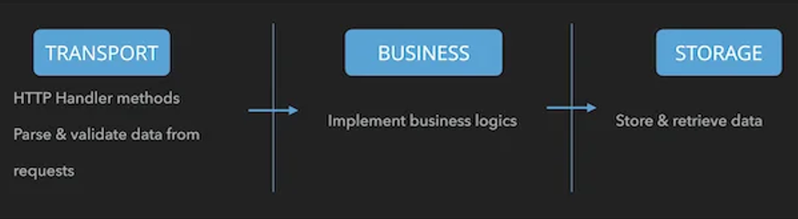

# Chat-Centrifugo

A real-time chat application with end-to-end encryption (E2E) built using Go, following clean architecture principles. The system leverages Centrifugo for pub/sub messaging, PostgreSQL for relational data (users, conversations, participants), and ScyllaDB for storing encrypted messages.

## Features

- **User Authentication**: Register and login with username/password, JWT-based session management.
- **End-to-End Encryption**: Messages are encrypted client-side using RSA-2048 keys (via JSEncrypt). Private keys are stored locally (demo: localStorage; production: secure key store).
- **Real-Time Messaging**: Powered by Centrifugo for instant message delivery via WebSockets.
- **Group Conversations**: Create and manage group chats with multiple participants.
- **Public Key Management**: Automatic key generation, storage, and synchronization for E2E encryption.
- **Clean Architecture**: Organized into Transport, Business, and Storage layers for maintainability.

## Architecture

The application follows Clean Architecture with three main layers:

- **Transport**: Handles HTTP requests (Gin framework), parses input, and returns JSON responses.
- **Business**: Contains core logic for authentication, messaging, and conversation management.
- **Storage**: Manages data persistence using PostgreSQL (GORM) for relational data and ScyllaDB (gocql) for message storage.



## Technologies

- **Backend**: Go 1.25.5, Gin (HTTP framework), GORM (ORM), gocql (ScyllaDB driver)
- **Real-Time**: Centrifugo v5.4.1 (pub/sub), Redis (engine)
- **Databases**: PostgreSQL 15 (users, conversations), ScyllaDB (messages)
- **Security**: JWT (authentication), RSA (E2E encryption)
- **Deployment**: Docker, Docker Compose

## Installation

### Prerequisites

- Docker and Docker Compose
- Go 1.25.5 (for local development)
- Make (optional, for build scripts)

### Quick Start with Docker

1. Clone the repository:
   ```bash
   git clone <repository-url>
   cd chat-centrifugo
   ```

2. Start the services:
   ```bash
   make up
   ```

3. Initialize infrastructure (databases, keyspaces):
   ```bash
   make init
   ```

4. Check status:
   ```bash
   make check
   ```

The application will be available at:
- API: http://localhost:8080
- Centrifugo: http://localhost:8000
- Test Client: Open `test_client.html` in your browser

### Local Development

1. Install dependencies:
   ```bash
   go mod download
   ```

2. Set up databases (use Docker Compose for Postgres, ScyllaDB, Redis, Centrifugo).

3. Run migrations:
   ```bash
   make migrate-up
   ```

4. Build and run:
   ```bash
   go run cmd/chat/main.go
   ```

## Configuration

Configuration is managed via environment variables or `config/config.yaml`. Defaults are set for Docker development.

### Environment Variables

- `POSTGRES_DSN`: PostgreSQL connection string
- `SCYLLA_HOSTS`: Comma-separated ScyllaDB hosts
- `SCYLLA_KEYSPACE`: ScyllaDB keyspace name
- `REDIS_URL`: Redis URL
- `CENTRIFUGO_API_URL`: Centrifugo API endpoint
- `CENTRIFUGO_API_KEY`: Centrifugo API key
- `JWT_SECRET`: Secret for JWT signing
- `PORT`: Server port (default: 8080)

### Centrifugo Configuration

See `centrifugo_config.json` for Centrifugo settings, including Redis engine and chat namespace.

## Usage

### API Endpoints

- **Authentication**:
  - `POST /api/v1/auth/register`: Register user with public key
  - `POST /api/v1/auth/login`: Login and get JWT

- **Chat**:
  - `POST /api/v1/chat/messages`: Send encrypted message
  - `GET /api/v1/users/{userId}/public-key`: Get user's public key

- **Conversations**:
  - `POST /api/v1/conversations/group`: Create group conversation
  - `GET /api/v1/conversations`: Get user's conversations

All endpoints use Bearer token authentication for protected routes.

### Test Client

Open `test_client.html` in a browser to test the chat functionality. It includes:
- User registration/login
- RSA key generation and management
- Real-time encrypted messaging
- Connection to Centrifugo WebSocket

**Note**: The test client stores private keys in localStorage (not secure for production). Use a proper key management system in production.

## Development

### Project Structure

```
cmd/chat/          # Main application entry point
config/            # Configuration management
middleware/        # JWT middleware
module/chat/       # Chat module (business, model, storage, transport)
pkg/               # Shared packages (centrifugo, hashing, jwt)
routes/            # Route definitions
migrations/        # Database migrations
test/              # Integration tests
```

### Gitflow Workflow


- Feature branches from `master`
- Merge features to `develop` for staging
- Release branches for production testing
- Hotfix branches for urgent fixes

### Testing

Run integration tests:
```bash
go test ./test/integration/
```

### Building

```bash
go build -o bin/chat cmd/chat/main.go
```

### Linting

```bash
make lint
```

## Contributing

1. Follow the Gitflow workflow.
2. Ensure tests pass and code is linted.
3. Update documentation as needed.

## License

[Specify license if applicable]

## Version

develop:version.txt
